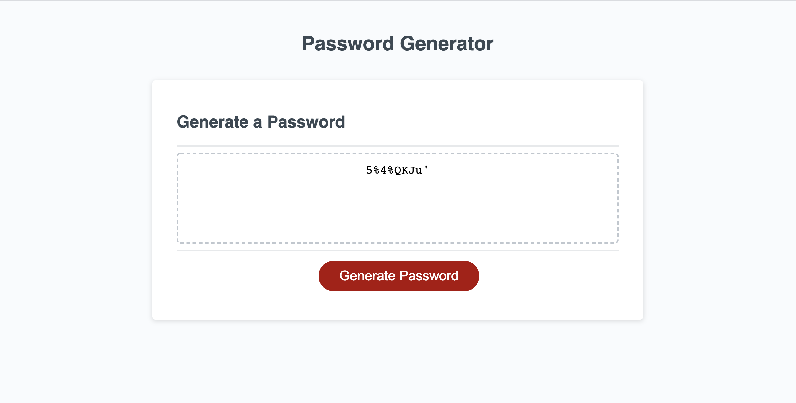

# week3-homework
The random password generator can create a strong password for the user that meets their selected criteria.


Link to deployed application:
<a href="https://grahamelphick.github.io/week3-homework/">https://grahamelphick.github.io/week3-homework/</a>


To operate the random password generator, the user simply needs to click the "Generate Password" button; answer a prompt with a number between 8 and 128 that indicates how long the password should be; and confirm or deny the use of certain types of characters as prompted. The random password will then appear in the textbox that sits above the "Generate Password" button.

If the user enters an invalid number of characters, they will be alerted that the number is invalid and prompted to try again.

If a user denies the use of every character type, they will be alerted that at least one character type must be selected and prompted to try again.


```